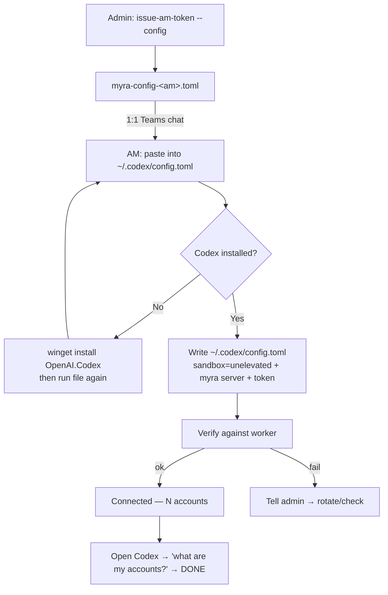
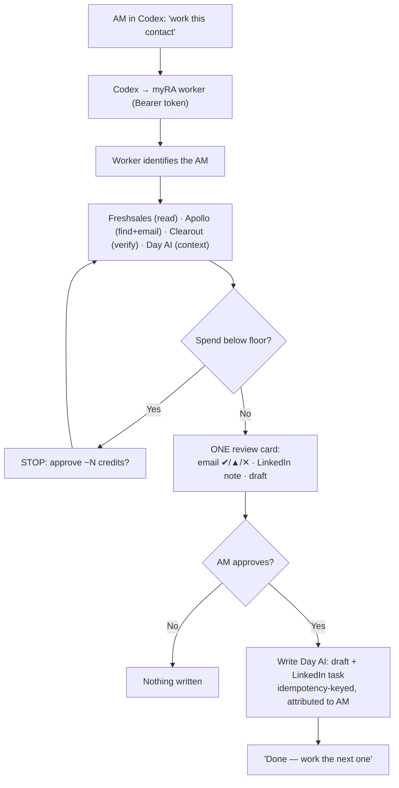

# myRA — how the flow works

Two flows: **(A) one-time setup** and **(B) daily use**. ASCII first (renders anywhere); Mermaid versions at the bottom for nicer rendering.

---

## A. One-time setup (admin → AM → connected)

```
ADMIN (you)                                   AM (Kirandeep / Sudeshana / Nikita / Vijay)
═══════════                                   ═══════════════════════════════════════════
issue-am-token --am <email> --config
   │   issues a personal token in KV
   │   (instant — no redeploy)
   ▼
.tokens/myra-config-<am>.toml
   │
   └──── send in a 1:1 Teams chat ─────────►  receives zip + message
                                                   │
                                                   ▼
                                              paste snippet into ~/.codex/config.toml
                                                   │
                                          ┌────────┴─────────┐
                                          ▼                  
                                   Is Codex installed?
                                     │            │
                                  No │            │ Yes
                                     ▼            ▼
                       run `winget install   writes ~/.codex/config.toml:
                        OpenAI.Codex`          • [windows] sandbox = "unelevated"   (kills the sandbox error)
                        then double-click      • [mcp_servers.myra] url + Bearer token
                        the file again            │
                          └───────────────────────┤
                                                   ▼
                                       verify against the worker
                                       (initialize + list_my_accounts)
                                          │                 │
                                       ok │                 │ fail
                                          ▼                 ▼
                              "Connected — you have    "Couldn't reach worker"
                                 N accounts."           → tell admin ──► back to ADMIN
                                          │                              (rotate token / check)
                                          ▼
                              open Codex → type "what are my accounts?"
                                          │
                                          ▼
                                   list appears → DONE
```

**Key point:** the config snippet connects **Codex → the myRA worker**. The AM never logs into Day AI / Apollo / Freshsales / Clearout — those sit behind the worker.

---

## B. Daily use (what happens when an AM works)

```
AM in Codex types:  "what are my accounts?"  /  "work this contact"  /  "work the next one"
        │
        ▼
   Codex  ── already knows myRA's tools + instructions from the MCP connection
        │
        │   HTTPS, with the AM's Bearer token
        ▼
   myRA worker (Vercel)  ── identifies WHICH AM from the token
        │
        │   runs the right tools (results cached: Exa/Apollo/Clearout/Day AI)
        ├──────────────► Freshsales   read-only — who Mordor already knows
        ├──────────────► Apollo       find the contact + unmask email
        ├──────────────► Clearout     verify the email is deliverable
        └──────────────► Day AI       read existing context
        │
        ▼
   ┌─────────────────── cost gate ───────────────────┐
   │ Would this spend push credits below the floor?  │
   │     No → continue        Yes → STOP:            │
   │                          "this costs ~N credits,│
   │                           approve?" → AM says    │
   │                           yes → re-run w/ spend  │
   └─────────────────────────────────────────────────┘
        │
        ▼
   build ONE review card:
     • Email + verdict   ✔ verified / ▲ risky / ✕ invalid
     • LinkedIn note (you send manually) + profile URL
     • Draft email (non-salesy first touch)
        │
        ▼
   AM reviews ──────► approve?
        │                 │
     No │                 │ Yes
        ▼                 ▼
   nothing written   worker writes to Day AI:
                       • draft (never sends)
                       • LinkedIn task
                     idempotency-keyed (a retry never duplicates),
                     attributed to the AM
        │
        ▼
   "Done — say 'work the next one'"
```

**Guardrails baked into the flow:** only a *verified* email is queue-ready; nothing is ever sent automatically; every Day AI write needs the AM's approval; spend is gated server-side.

---

## Mermaid (for viewers that render it)

### Setup


### Daily use

